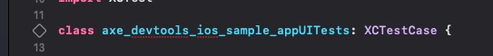

# axe-devtools-ios-sample-app

A sample application built solely to showcase axe DevTools Mobile implementation. It is non-functional and made inaccessibly by design.

Library documentation can be found at [docs.deque.com](https://docs.deque.com/).

Learn more about [Deque and axe DevTools Mobile here](https://www.deque.com/).

> Prerequisites:
> - Xcode 13 +
> - Optional: If running locally on iPhone device, it'll need to have iOS 15+.

This project uses Swift Package Manager to pull in the frameworks from [axe-devtools-ios](https://github.com/dequelabs/axe-devtools-ios/).

## For Manual Testing

1. Add your Deque credentials to `SceneDelegate.swift`.
_This app is ready for manual testing out of the box; running it in Xcode will show the floating action button._

## For Automated Testing

1. In `SceneDelegate.swift`, comment out `axe?.showA11yFAB()` to remove manual mode, and uncomment the line for automated testing `axe?.showA11yFAB(customFAB: AutomatedTestFAB())`.

1. Within `SampleUITests-UIKit.swift`, add your Deque credentials to the `setUp` method.

1. Once you have a device or simulator ready to go, open `SampleUITests-UIKit.swift`, and tap on the diamond to run this suite. The simulator will launch, and the tests will run.

## For Automated Testing with Sauce Labs (Real Device Only)

_Note: XCUITests are only supported with a real device from Sauce at this time. This project requires a device on iOS 15.0 or later._

In the top center of the Xcode window, tap on the device drop-down and select your desired device.

### Set up Xcode

In the main Xcode menu, select Preferences, then Accounts. Sign in to your Apple Developer account and set up provisioning to sign the app. Sauce Labs will re-sign it, but we found fewer hiccups when this was set up.

### Set up for Sauce Labs

Install `saucectl` command-line interface. Follow the [instructions from Sauce Labs](https://docs.saucelabs.com/dev/cli/saucectl/).

Add your Sauce Labs credentials to your `.bash_profile` or `.zshenv`. Be sure to load the changes by running `source .filename`.

Follow [instructions from Sauce Labs](https://docs.saucelabs.com/dev/cli/saucectl/#associate-your-credentials).

### Running with Sauce Labs

We've created a shell script `prepareForSauce.sh` that uploads this project to Sauce Labs for testing. Run this with `sh prepareForSauce.sh` in the terminal to build the app, then upload it to Sauce for testing on a real device.
