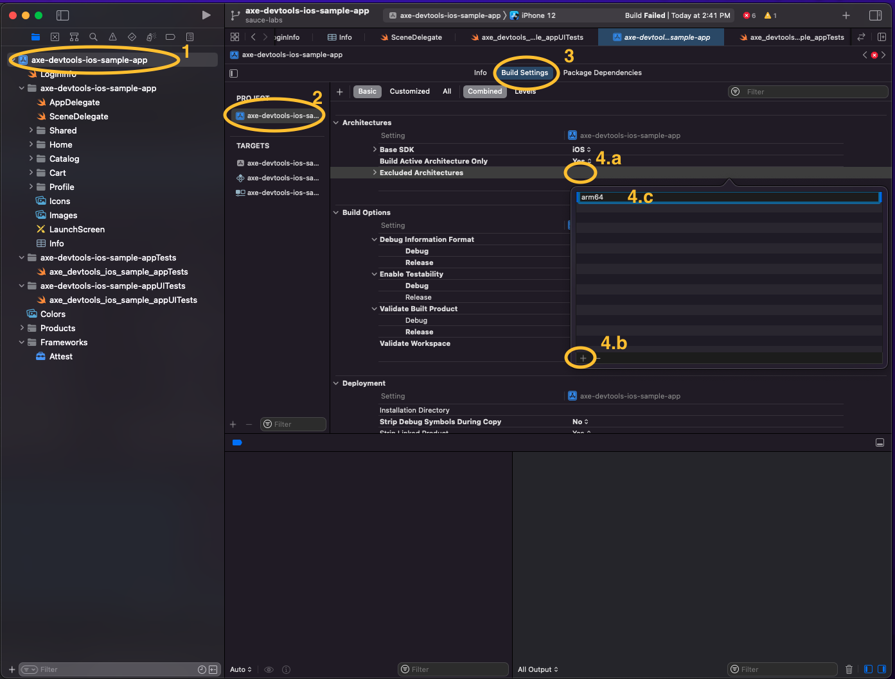

# axe-devtools-ios-sample-app

This is a sample application built solely to showcase axe DevTools Mobile implementation. It is non-functional and made inaccessibly by design.

For more information on axe DevTools Mobile please visit us. 
https://www.deque.com/ios-accessibility/
https://www.deque.com/android-accessibility/

> Prerequisites:
> - Xcode 13 +
> - Optional: If running locally on iPhone device, it'll need to have iOS 15+.

## Project Setup for Deque

1. Download the axe DevTools iOS Framework from Agora - [Attest.xcframework-2.10.1.zip](https://agora.dequecloud.com/ui/repos/tree/General/Attest-iOS/framework/Attest.xcframework-2.10.1.zip).

1. Pull the `.xcframework` file into your project's root folder.

1. Add your Deque credentials to `LoginInfo.swift`.
_This app is ready for automated testing; running it in Xcode will not show the floating action button until you change to manual mode in `SceneDelegate.swift`._

1. In the main Xcode menu, select Preferences, then Accounts. Sign into your Apple Developer account here and be sure to setup provisioning to sign the app. Sauce Labs will resign it, but we found less errors when this was setup.

### Optional: Run Locally

If you're going to run this locally (not on Sauce), follow the below tips:

#### To Run on a Simulator

Step numbers are highlighted in the screenshot below.
1. Select the project in the file navigator.
2. Select the main project in the settings pane
3. Select the tab 'Build Settings'
4.	a. In the field `Excluded Architectures`, double click to edit.
	b. Tap the `+` button in the bottom left of the modal.
	c. enter `arm64` then press enter.

Repeat steps 2, 3, and 4 for the targets `axe-devtools-ios-sample-app` and `axe-devtools-ios-sample-appUITests`.

#### To Run on a Device

You don't need the changes for the simulator above to run on a device. All you need is a device running iOS 15 or later.
In the top center of the window, tap on the device drop-down and select your desired device.

#### Ready to build

Once you have a device or simulator ready to go, open `axe_devtools_ios_sample_appUITests.swift` and tap on the diamond to run this suite. The simulator will launch, and the tests will run.

## Project Setup for Sauce Labs

Install `saucectl` command line interface. Follow the [instructions from Sauce Labs](https://docs.saucelabs.com/dev/cli/saucectl/).

Add your Sauce Labs credentials to your `.bash_profile` or `.zshenv`. Be sure to load the changes by running `source .filename`.

Follow [instructions from Sauce Labs](https://docs.saucelabs.com/dev/cli/saucectl/#associate-your-credentials).

## Running with Sauce Labs

We've created a shell script `prepareForSauce.sh` that uploads this project to Sauce Labs for testing. Run this with `sh prepareForSauce.sh` in terminal to build the app, then upload it to Sauce for testing on a real device.

_Note: XCUITests are only supported with a real device from Sauce at this time._