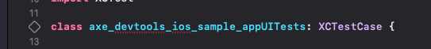

# iOS Sample App for axe DevTools Mobile by Deque

A sample application built solely to showcase axe DevTools Mobile implementation. It is non-functional and made inaccessibly by design.

<!-- Get started with a [free trial today](https://axe.dequelabs.com/signup?product=axe-devtools-mobile&redirect_uri=https://axe.dequelabs.com/axe-devtools-mobile/get-started).-->

## Helpful Links
- Library documentation and more information on automated or manual testing can be found at [docs.deque.com](https://docs.deque.com/devtools-mobile/).
- Learn more about [Deque and axe DevTools Mobile here](https://www.deque.com/).

------

## Two ways to test

This sample demonstrates both ways to run accessibility scans with axe DevTools Mobile. Each lives in its own folder under `axe-devtools-ios-sample-appUITests/` so you can find the pattern you need at a glance.

| Approach | What it does | Where to look | Credentials |
| --- | --- | --- | --- |
| **Targeted scanning** | You choose exactly which screens to scan with `axe.run(onElement:)`, then report via an HTML report and/or upload to the dashboard. | [`TargetedScan/TargetedScanUITests.swift`](axe-devtools-ios-sample-appUITests/TargetedScan/TargetedScanUITests.swift) | `Login.swift` |
| **AutoScan** | Zero-code: your test just drives the app (no imports, no scan calls). The framework automatically captures, de-duplicates, and scans each unique screen, then writes one HTML report. | [`AutoScan/AutoScanUITests.swift`](axe-devtools-ios-sample-appUITests/AutoScan/AutoScanUITests.swift) | [`axe_config.json`](axe-devtools-ios-sample-appUITests/axe_config.json) |

Both approaches produce a self-contained **HTML report** locally. With targeted scanning you call `generateHtmlReportAndSummary()` yourself; with AutoScan it happens automatically when the test bundle finishes — controlled entirely by `axe_config.json`. AutoScan ships **disabled** (`"axeAutoScanMode": false`); set it to `true` and add your credentials in that file to try it.

------

## Get Started:

> Prerequisites:
> - Xcode 15 +
> - Optional: If running locally on iPhone device, it'll need to have iOS 16+.

This project uses Swift Package Manager to pull in the frameworks from [axe-devtools-ios](https://github.com/dequelabs/axe-devtools-ios/).

1. Add your Deque API Key and your axe Developer Hub Project Id to `Login.swift` (for the targeted-scanning tests) and to `axe-devtools-ios-sample-appUITests/axe_config.json` (for the AutoScan tests).

2. Once you have a device or simulator ready to go, open either `TargetedScan/TargetedScanUITests.swift` or `AutoScan/AutoScanUITests.swift`, and tap on the diamond to run the suite. The simulator will launch, and the tests will run.

### For Automated Testing with Sauce Labs

_Note: This project requires a device on iOS 16.0 or later. Additionally, Virtual Devices running iOS 17.0 may experience hanging during testing. Use an iOS 16.2 Virtual Device to see a successful test run._

To run a test with this project, or to setup your own project, follow our online guide to get started with [XCUITesting on SauceLabs.](https://docs.deque.com/devtools-mobile/ios-example-sauce-labs-xcui)

Assuming you have already downloaded the sample project to your computer:
1. Add your Deque API Key and your axe Developer Hub Project Id to `Login.swift`.
2. Open a Terminal window, enter `cd `, then drag and drop the `axe-devtools-ios-sample-app` from Finder into the Terminal window. Hit return/enter.

To run on **Real Devices**, type `sh prepareForSauceRealDevice.sh` in the same window. Hit return/enter.

To run on **Virtual Devices**, type `sh prepareForSauceVirtualDevice.sh` in the same window. Hit return/enter.

These scripts will build the app for the appropriate device type and begin executing automated tests in your Sauce Labs environment.

## Have a Question? Found a bug?

[Reach out to us](https://docs.deque.com/devtools-mobile/help), we'd love to help!
